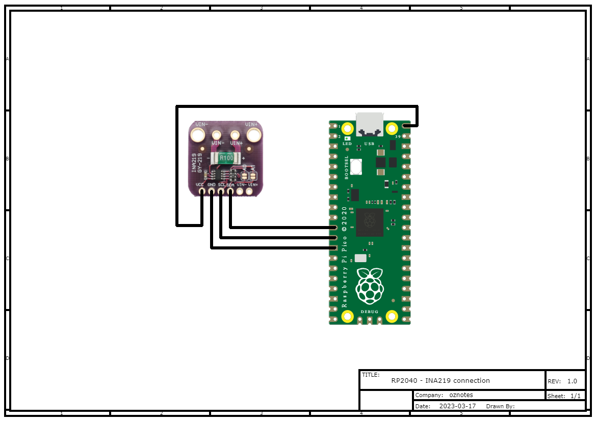

# INA219 Class C++ Library

This repository contains a C++ library for the INA219 current sensor. It also includes an example usage code that demonstrates how to use the library to read voltage, current, and power.

## Getting Started

### Prerequisites

To use this library, you need a Raspberry Pi Pico board, and an INA219 sensor. 
You also need to install the Pico SDK and add it to your system path.

### Wiring



Follow the wiring diagram above to connect the INA219 sensor to the Raspberry Pi Pico board.

### Installation

1. Clone this repository to your Raspberry Pi Pico board.
2. Copy the `INA219_driver` folder to your project folder.
3. Copy the `INA219.h` header file to your project folder.
4. Copy the example code below to your project file.

```cpp
#include <stdio.h>
#include "pico/stdlib.h"
#include "INA219_driver/INA219.h"

int main() {
    //i2c bus, i2c address
    INA219 ina219(i2c0, 0x40);
    //SDA pin 8, SCL pin 9, 400 kHz speed
    ina219.I2C_START(8, 9, 400);
    // Calibrate for 0.1 Ohm shunt resistor and 3.2A max expected current
    ina219.calibrate(0.1, 3.2);

    while (1) {
        float voltage = ina219.read_voltage();
        float shunt_voltage = ina219.read_shunt_voltage();
        float current = ina219.read_current();
        float power = ina219.read_power();

        printf("Voltage: %.4f V\n", voltage);
        printf("Shunt Voltage: %.4f mV\n", shunt_voltage);
        printf("Current: %.4f A\n", current);
        printf("Power: %.4f W\n", power);
        printf("--------------------\n");

        sleep_ms(1000);
    }
}
```
## Contributing

If you find a bug or have an idea for a new feature, please create an issue in the GitHub repository. 
We welcome pull requests for bug fixes and new features.
